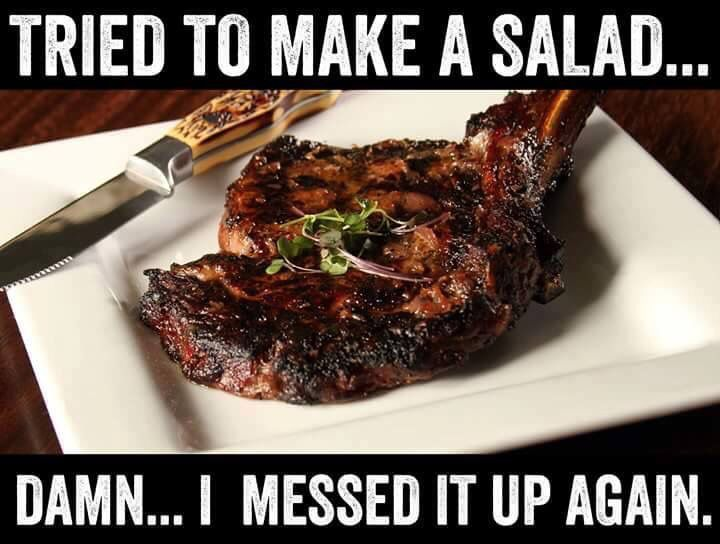
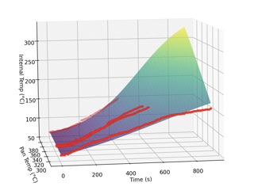
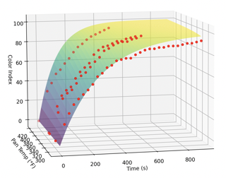
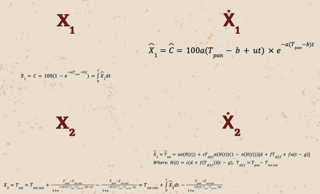
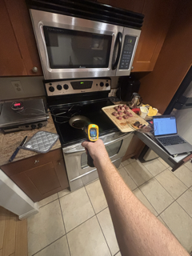

# Nonlinear Modeling and Control of Steak Searing 🥩

A nonlinear control systems approach for searing steak to achieve optimal internal temperature and sear quality.

  

## Project Overview

Cooking the perfect steak is a balance of art and science. This project investigates the nonlinear aspects of cooking steak, models them as a dynamic system, and develops controllers to reliably achieve targeted steak internal temperature and sear quality.

## Table of Contents
- [Background](#background)
- [Previous Work](#previous-work)
- [General Approach](#general-approach)
- [Internal Temperature Modeling](#internal-temperature-modeling)
- [Searing Index Modeling](#searing-index-modeling)
- [System Representation](#system-representation)
- [Finding Constants](#finding-constants)
- [Control Derivation](#control-derivation)
- [Results](#results)
- [Conclusions & Future Work](#conclusions--future-work)
- [Sources](#sources)

## Background

Achieving consistently perfect steak can be challenging. By applying nonlinear control theory, we can precisely model and control steak internal temperature and surface sear, enabling repeatable cooking outcomes.

## Previous Work

- Development of computational models for steak cooking dynamics.
- Mathematical modeling of meat cooking using polymer-solvent analogies.
- Exploration of extreme methods to optimize steak searing quality.

## General Approach

1. Derive equations for internal temperature and searing index.
2. Collect experimental data at various cooking conditions.
3. Estimate nonlinear model parameters from data.
4. Model the steak cooking process as a nonlinear control problem.
5. Design control strategies to achieve desired internal temperatures and sear quality.

## Internal Temperature Modeling

Internal temperature is modeled as a sigmoid function, capturing the slow initial heating, rapid temperature increase, and final plateauing typical during cooking.

  

## Searing Index Modeling

Searing is represented using an exponential function, reflecting rapid initial browning followed by a slower approach toward a maximum sear index.

  

## System Representation

The steak-cooking system is represented by three state variables:

- `X1`: Sear level
- `X2`: Internal temperature
- `X3`: Pan temperature (`Tpan`)

  

## Finding Constants

### Experimental Setup:
- Used 1-inch thick sirloin steaks for consistent results.
- Internal temperature monitored every 10 seconds via meat probes.
- Pan temperature recorded every 30 seconds using an infrared thermometer.
- Visual assessments of sear quality conducted every 30 seconds.

  

(Constants estimated from experimental data are detailed within project documentation.)

## Control Derivation

- Employed PID control with feed-forward scheduling for precise cooking regulation.
- Simulations were discretized at 10 ms intervals; controls updated every second.
- Tested common cooking methods:
  - Forward Sear
  - Reverse Sear
  - Static Temperature Cooking (optimal method)

## Results

### Basic Simulation
Successfully synchronized internal temperature and sear goals within a 1-second margin.

  

### Heat Loss Scenario
PID controller effectively maintained performance despite simulated convective heat loss and larger steak sizes.

  

### Altered Initial Temperature
Dynamic gain scheduling provided resilience against varying initial pan temperatures.

  

## Conclusions & Future Work

### Future Enhancements:
- **Reinforcement Learning** to optimize adaptive cooking controls.
- **Enhanced Modeling** incorporating detailed fat, muscle, and moisture dynamics.
- **Embedded Systems** for practical, real-time smart cooking devices.

### Abandoned Approaches ("Control Graveyard"):
- Dual PID Control ❌
- Model Predictive Control (MPC) ❌
- Online Temperature Planning ❌

## Sources

1. [Steak Temperature Tips - Ruth's Chris](https://ruthschris.net/blog/steak-temperature-tips/)
2. [Reverse-Seared Ribeye - Seared and Smoked](https://searedandsmoked.com/reverse-seared-ribeye/)
3. [Computational Meat Cooking Model - ScienceDirect](https://www.sciencedirect.com/science/article/pii/S0260877421000236)
4. [Polymer-Solvent Analogy for Meat Cooking - ScienceDirect](https://www.sciencedirect.com/science/article/pii/S0307904X14006830)
5. [Extreme Steak Techniques - Amazing Ribs](https://amazingribs.com/more-technique-and-science/more-cooking-science/extreme-steak-wild-and-crazy-ways-get-killer-sear/)
6. [Smart Health Devices Overview - GoodRx](https://www.goodrx.com/healthcare-access/digital-health/smart-scales)
7. [Steak Salad Picture](https://www.pinterest.com/pin/220676450469780251/)

---

> Created by Elliot Weiner ([elweiner@bu.edu](mailto:elweiner@bu.edu)).

😎 Let me cook!
