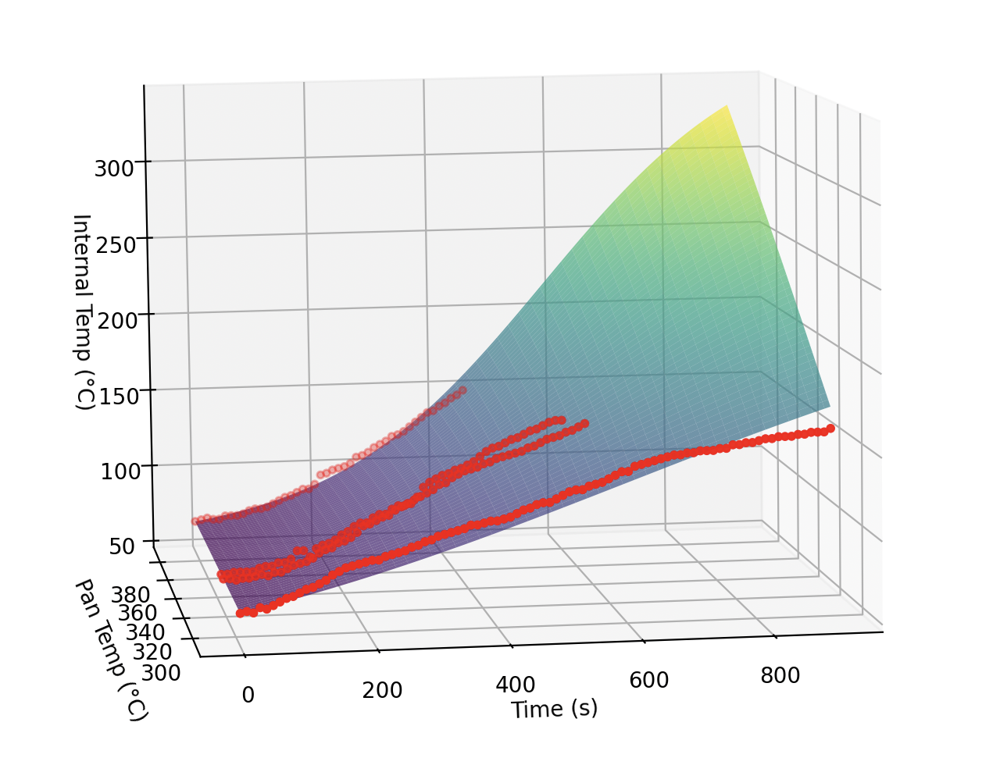

Let me cook 😎 🥩


# Nonlinear Modeling of Steak

A nonlinear control systems approach to searing steak with optimal doneness and sear quality.

## Project Overview

Cooking the perfect steak is a blend of art and science. This project models steak searing and internal cooking dynamics using nonlinear control theory. It proposes mathematical models for temperature and searing, simulates system responses, and develops controllers to achieve a target steak finish.

## Table of Contents
- [Background](#background)
- [Previous Work](#previous-work)
- [General Approach](#general-approach)
- [Internal Temperature Modeling](#internal-temperature-modeling)
- [Searing Index Modeling](#searing-index-modeling)
- [System Representation](#system-representation)
- [Finding Constants](#finding-constants)
- [Control Derivation](#control-derivation)
- [Results](#results)
- [Conclusions & Future Work](#conclusions--future-work)
- [Sources](#sources)

## Background

Cooking steak to perfection is elusive for many. By applying nonlinear control techniques, we can model and control the steak's internal temperature and surface sear to achieve consistent results.

## Previous Work

- Development and validation of computational models for steak cooking.
- Mathematical modeling of meat cooking based on polymer-solvent analogy.
- Exploration of extreme methods for achieving a superior sear.

## General Approach

1. Derive approximate equations for internal temperature and searing index.
2. Gather experimental data at various temperatures and times.
3. Apply nonlinear parameter estimation.
4. Model the system as a nonlinear control problem.
5. Derive control strategies to reach target internal temperature and sear at final time `t_final`.

## Internal Temperature Modeling

- Temperature evolution is slow initially, speeds up, then slows again — modeled approximately as a sigmoid curve.


## Searing Index Modeling

- Searing happens rapidly at first, then plateaus.
- Modeled using an exponential function based on visual inspection.



## System Representation

- `X1` and `Ẋ1`: Variables for sear control.
- `X2` and `Ẋ2`: Variables for internal temperature control.
- `X3` and `Ẋ3`: Introduced pan temperature (`Tpan`) as a controllable state variable.


## Finding Constants

**Experiment Setup:**
- 1-inch thick steaks.
- Thermometer probe for internal temp (logged every 10 seconds).
- Infrared thermometer for pan temperature (verified every 30 seconds).
- Visual inspection for sear quality.


**Internal Temperature Model Constants:**
```
a = 1.1
b = -3.908e-03
c = 2.742e-05
d = 587.7
Tinit = 66°F
```

**Searing Index Constants:**
```
a = 3.315151e-05
b = 170.604
Cmax = 100
```

## Control Derivation

- Introduced PID control and feed-forward scheduling to regulate temperature and searing.
- Simulations discretized system at 10 ms intervals and updated control inputs every second.
- Investigated common cooking methods:
  - Forward Sear
  - Reverse Sear
  - Static Temperature Cooking


## Results

**Basic Simulation Results:**
- Let pan reach a target temperature before cooking begins.
- Internal and surface temps achieved goals within 1 second of each other.


**Added Heat Loss Scenario:**
- PID controller introduced robustness to convective losses and larger meat pieces.


**Altered Initial Temperature:**
- Dynamic gain scheduling proposed to counter varying starting conditions.


## Conclusions & Future Work

**Future Enhancements:**
- **Reinforcement Learning**: for smarter temp/sear control.
- **Better Modeling**: include fat/muscle structure data.
- **Embedded Control Systems**: smart steak cooking devices.

**Abandoned Approaches ("Control Graveyard"):**
- Dual PID control ❌
- Model Predictive Control (MPC) ❌
- Online Temperature Planning ❌

## Sources

1. [Steak Temperature Tips - Ruth's Chris](https://ruthschris.net/blog/steak-temperature-tips/)
2. [Reverse-Seared Ribeye - Seared and Smoked](https://searedandsmoked.com/reverse-seared-ribeye/)
3. [Computational Meat Cooking Model - ScienceDirect](https://www.sciencedirect.com/science/article/pii/S0260877421000236)
4. [Polymer-Solvent Analogy for Meat Cooking - ScienceDirect](https://www.sciencedirect.com/science/article/pii/S0307904X14006830)
5. [Extreme Steak Techniques - Amazing Ribs](https://amazingribs.com/more-technique-and-science/more-cooking-science/extreme-steak-wild-and-crazy-ways-get-killer-sear/)
6. [Salt Bae Meme](https://tenor.com/view/saltbae-salt-bae-steak-cooking-gif-18552645)
7. [Smart Health Devices Overview - GoodRx](https://www.goodrx.com/healthcare-access/digital-health/smart-scales)

---

> Created by Elliot Weiner.
